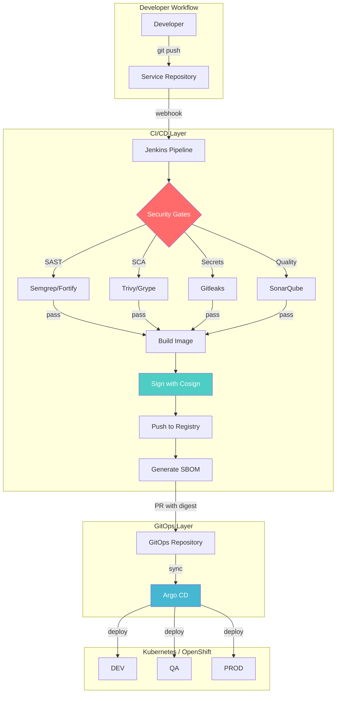
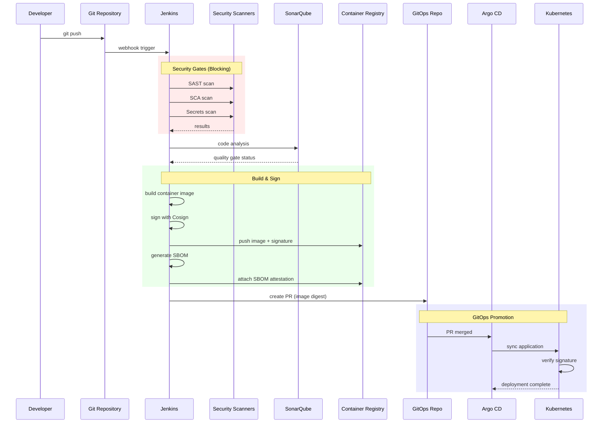
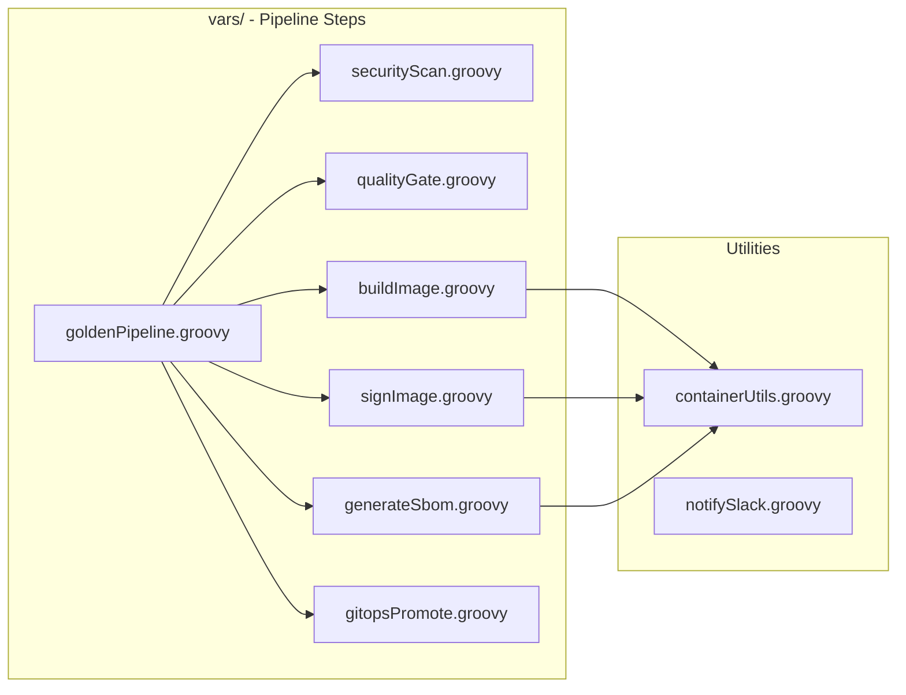
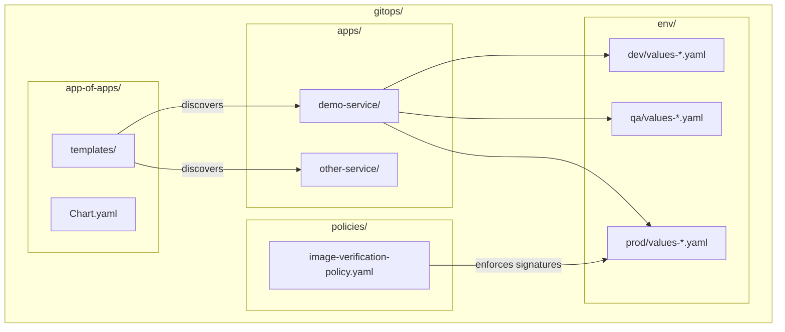
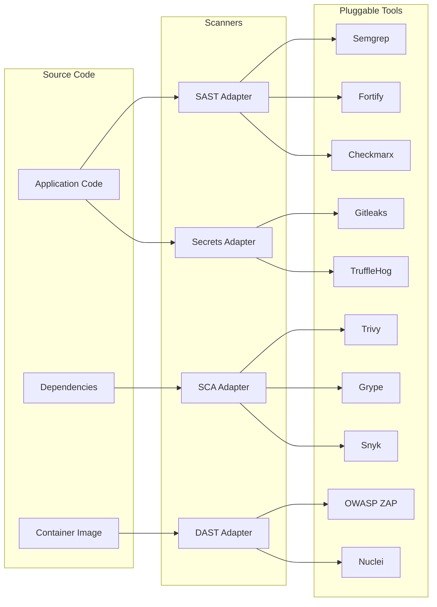
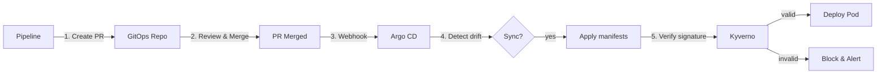
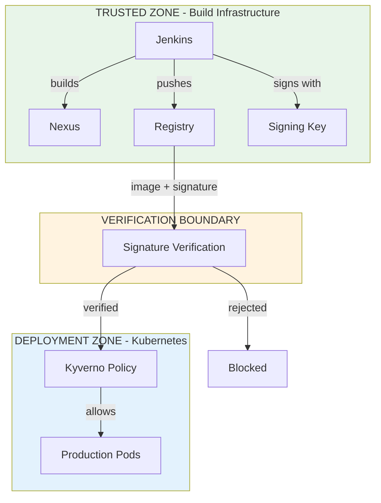
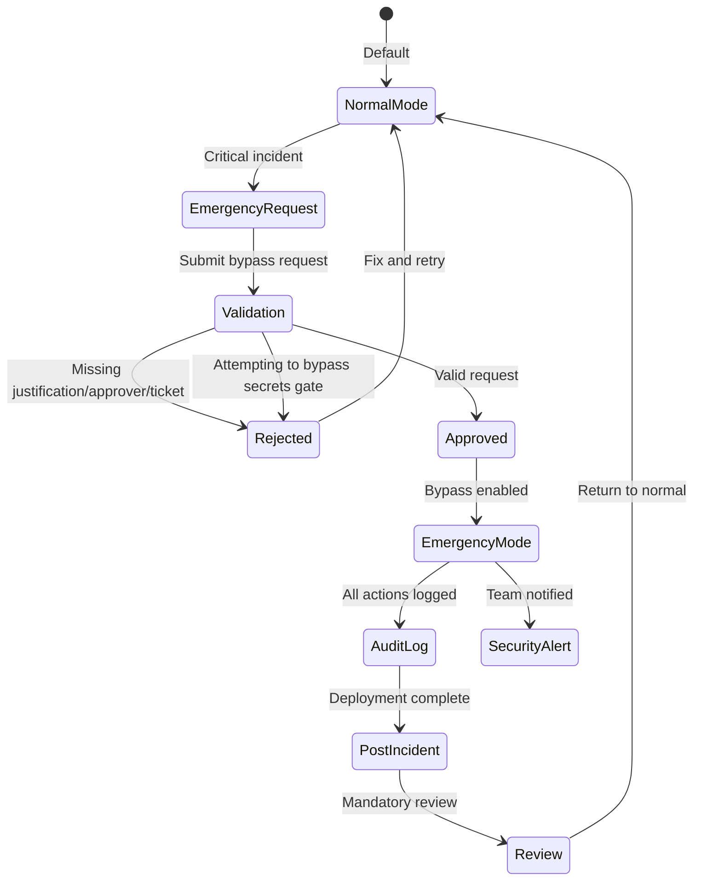
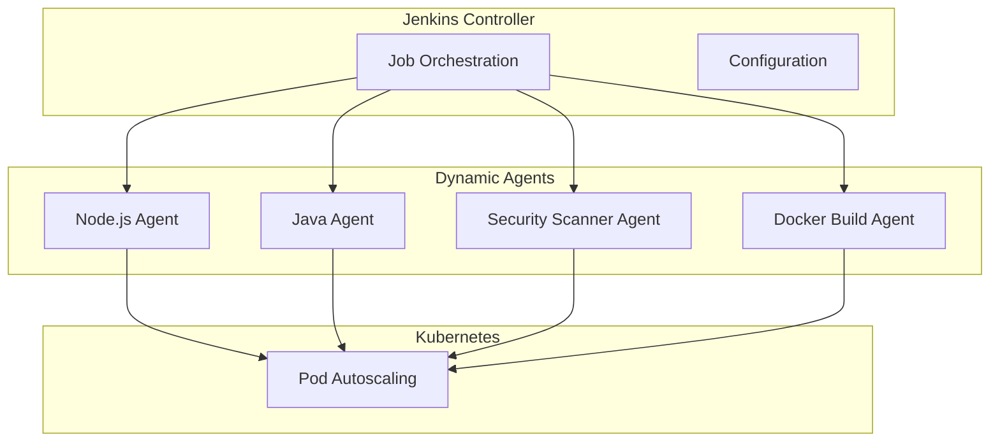
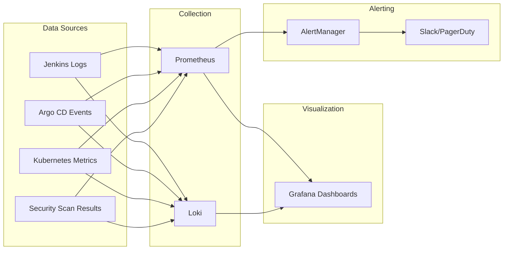

# Architecture Overview

This document provides a technical deep-dive into the Golden Path architecture.

## System Context



## Pipeline Flow



## Component Details

### Jenkins Shared Library

The shared library provides standardized pipeline steps:



```
jenkins-shared-library/
├── vars/                    # Global pipeline functions
│   ├── goldenPipeline.groovy   # Main orchestration
│   ├── qualityGate.groovy      # SonarQube integration
│   ├── securityScan.groovy     # SAST/SCA/DAST orchestration
│   ├── buildImage.groovy       # Container build
│   ├── signImage.groovy        # Cosign signing
│   ├── generateSbom.groovy     # SBOM generation
│   ├── gitopsPromote.groovy    # Environment promotion
│   └── containerUtils.groovy   # Shared utilities
├── src/org/acme/            # Shared classes
└── test/groovy/             # Spock unit tests
```

### GitOps Structure



```
gitops/
├── app-of-apps/             # Bootstrap application
│   └── templates/
│       └── application.yaml    # Discovers all apps
├── apps/                    # Application definitions
│   └── demo-service/
│       ├── Chart.yaml
│       └── templates/
│           ├── deployment.yaml
│           ├── service.yaml
│           └── ingress.yaml
├── env/                     # Environment overrides
│   ├── dev/values-*.yaml
│   ├── qa/values-*.yaml
│   └── prod/values-*.yaml
└── policies/                # Admission policies
    └── image-verification-policy.yaml
```

### Security Scanning Architecture



## Data Flow

### Build Flow

1. Developer pushes code
2. Jenkins webhook triggers pipeline
3. Pipeline executes stages:
   - Checkout source
   - Build application
   - Run tests
   - Execute security scans (parallel)
   - Check quality gate
   - Build container image
   - Push to registry
   - Sign image with Cosign
   - Generate and attach SBOM

### Deployment Flow



## Security Architecture

### Trust Boundaries



### Artifact Integrity

Every artifact has:

| Attribute | Purpose | Tool |
|-----------|---------|------|
| **Digest** | SHA256 hash for immutability | Container Runtime |
| **Signature** | Cryptographic proof of authenticity | Cosign |
| **SBOM** | Bill of materials for transparency | Syft/CycloneDX |
| **Provenance** | Build metadata for traceability | SLSA |

### Emergency Mode Flow



## Scalability Considerations

### Jenkins Scaling



- Use Jenkins agents for parallel builds
- Separate agents by workload type
- Consider Kubernetes-based dynamic agents

### Registry Scaling

- Use registry replication for performance
- Implement garbage collection for storage
- Consider geo-distributed registries

### GitOps Scaling

- One Argo CD per cluster (or hub-spoke)
- ApplicationSets for multi-cluster
- Progressive sync for large deployments

## Monitoring & Observability



### Key Metrics

| Metric | Target | Alert Threshold |
|--------|--------|-----------------|
| Deployment Frequency | Daily | < 1/week |
| Lead Time | < 1 day | > 3 days |
| Change Failure Rate | < 5% | > 10% |
| MTTR | < 1 hour | > 4 hours |
| Critical Vulns in Prod | 0 | > 0 |
