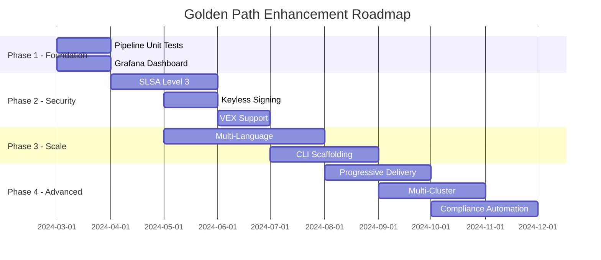

# Roadmap - Going Further

This document outlines potential enhancements to take the Golden Path from production-ready to industry-leading.

## Current State

The Golden Path currently provides:
- Standardized CI/CD with Jenkins Shared Library
- Security scanning (SAST, SCA, Secrets, DAST)
- Container image signing with Cosign
- SBOM generation (CycloneDX)
- GitOps promotion with Argo CD
- Kyverno admission policies for signature verification

## Priority 1 - Testing Excellence

### Jenkins Pipeline Unit Tests

Add comprehensive unit tests for the shared library using [jenkins-pipeline-unit](https://github.com/jenkinsci/JenkinsPipelineUnit).

```groovy
// test/groovy/vars/BuildImageTest.groovy
class BuildImageTest extends BasePipelineTest {
    @Test
    void "should build with correct labels"() {
        def script = loadScript("vars/buildImage.groovy")
        script.call(appName: 'test-app', registry: 'registry.example.com')

        assertJobStatusSuccess()
        assertThat(helper.callStack)
            .contains("sh(docker build --label org.opencontainers.image.revision=*)")
    }
}
```

**Benefits:**
- Catch regressions before deployment
- Enable confident refactoring
- Document expected behavior

### Integration Test Suite

```yaml
# .github/workflows/integration-tests.yml
jobs:
  integration:
    runs-on: ubuntu-latest
    services:
      registry:
        image: registry:2
        ports: ['5000:5000']
    steps:
      - name: Run full pipeline simulation
        run: |
          # Build, sign, push, verify complete flow
          make integration-test
```

---

## Priority 2 - Observability

### Grafana Dashboard for Pipeline Metrics

```json
// monitoring/grafana/dashboards/golden-path-pipeline.json
{
  "title": "Golden Path Pipeline Metrics",
  "panels": [
    {
      "title": "Deployment Frequency",
      "type": "stat",
      "targets": [{ "expr": "sum(rate(jenkins_builds_total{result='SUCCESS'}[24h]))" }]
    },
    {
      "title": "Lead Time for Changes",
      "type": "gauge",
      "targets": [{ "expr": "avg(jenkins_build_duration_seconds)" }]
    },
    {
      "title": "Change Failure Rate",
      "type": "stat",
      "targets": [{ "expr": "sum(jenkins_builds_total{result='FAILURE'}) / sum(jenkins_builds_total)" }]
    },
    {
      "title": "Security Scan Findings",
      "type": "timeseries",
      "targets": [{ "expr": "sum by (severity) (security_vulnerabilities_total)" }]
    }
  ]
}
```

### DORA Metrics Implementation

| Metric | Data Source | Target |
|--------|-------------|--------|
| Deployment Frequency | Jenkins builds per day | > 1/day |
| Lead Time | Commit to production | < 1 day |
| Change Failure Rate | Failed deployments / total | < 5% |
| MTTR | Time to restore service | < 1 hour |

---

## Priority 3 - Advanced Supply Chain Security

### SLSA Level 3 Compliance

```yaml
# Provenance attestation with in-toto
steps:
  - name: Generate SLSA Provenance
    uses: slsa-framework/slsa-github-generator/.github/workflows/generator_container_slsa3.yml@v1.9.0
    with:
      image: ${{ env.IMAGE }}
      digest: ${{ env.DIGEST }}
```

### Sigstore Keyless Signing

```groovy
// vars/signImage.groovy - Keyless mode
def signKeyless(String image) {
    withCredentials([string(credentialsId: 'oidc-token', variable: 'SIGSTORE_ID_TOKEN')]) {
        sh """
            COSIGN_EXPERIMENTAL=1 cosign sign \
                --fulcio-url=https://fulcio.sigstore.dev \
                --rekor-url=https://rekor.sigstore.dev \
                ${image}
        """
    }
}
```

### VEX (Vulnerability Exploitability eXchange)

```json
// vex/demo-service.vex.json
{
  "@context": "https://openvex.dev/ns/v0.2.0",
  "statements": [
    {
      "vulnerability": { "name": "CVE-2023-XXXXX" },
      "products": [{ "@id": "pkg:oci/demo-service" }],
      "status": "not_affected",
      "justification": "vulnerable_code_not_in_execute_path"
    }
  ]
}
```

---

## Priority 4 - Multi-Language Support

### Build Tool Matrix

| Language | Build Tool | Scanner | Container Base |
|----------|-----------|---------|----------------|
| Node.js | npm/yarn | npm audit | node:alpine |
| Java | Maven/Gradle | OWASP Dependency-Check | eclipse-temurin |
| Python | pip/poetry | safety/pip-audit | python:slim |
| Go | go build | govulncheck | scratch/distroless |
| Rust | cargo | cargo-audit | rust:alpine |

### Example: Java Support

```groovy
// vars/goldenPipeline.groovy
switch(config.buildTool) {
    case 'maven':
        sh 'mvn clean package -DskipTests'
        sh 'mvn dependency-check:check'
        break
    case 'gradle':
        sh './gradlew build -x test'
        sh './gradlew dependencyCheckAnalyze'
        break
}
```

---

## Priority 5 - Policy as Code

### OPA/Gatekeeper Policies

```rego
# policies/rego/require-security-scan.rego
package pipeline.security

deny[msg] {
    input.securityScan.enabled == false
    msg := "Security scanning cannot be disabled"
}

deny[msg] {
    input.securityScan.failOnCritical == false
    msg := "Pipeline must fail on critical vulnerabilities"
}
```

### Kyverno Enhanced Policies

```yaml
# gitops/policies/require-labels.yaml
apiVersion: kyverno.io/v1
kind: ClusterPolicy
metadata:
  name: require-golden-path-labels
spec:
  validationFailureAction: Enforce
  rules:
    - name: check-labels
      match:
        resources:
          kinds: [Deployment]
      validate:
        message: "Deployments must have golden-path labels"
        pattern:
          metadata:
            labels:
              app.kubernetes.io/managed-by: "golden-path"
              app.kubernetes.io/version: "?*"
```

---

## Priority 6 - Developer Experience

### Service Scaffolding CLI

```bash
# golden-path CLI
$ golden-path init my-service --language=node --framework=express

Creating my-service/
  ├── src/
  ├── test/
  ├── Dockerfile
  ├── Jenkinsfile          # Pre-configured for golden-path
  ├── helm/
  │   └── values.yaml
  └── .github/
      └── CODEOWNERS

Service created! Run 'git push' to trigger your first pipeline.
```

### IDE Integration

```json
// .vscode/extensions.json
{
  "recommendations": [
    "redhat.vscode-yaml",
    "ms-kubernetes-tools.vscode-kubernetes-tools",
    "signageos.signageos-vscode-sops"
  ]
}
```

### Pre-commit Hooks

```yaml
# .pre-commit-config.yaml
repos:
  - repo: https://github.com/gitleaks/gitleaks
    rev: v8.18.0
    hooks:
      - id: gitleaks
  - repo: https://github.com/hadolint/hadolint
    rev: v2.12.0
    hooks:
      - id: hadolint
  - repo: https://github.com/antonbabenko/pre-commit-terraform
    rev: v1.83.0
    hooks:
      - id: terraform_validate
```

---

## Priority 7 - Advanced GitOps

### Progressive Delivery with Argo Rollouts

```yaml
# gitops/apps/demo-service/templates/rollout.yaml
apiVersion: argoproj.io/v1alpha1
kind: Rollout
metadata:
  name: demo-service
spec:
  strategy:
    canary:
      steps:
        - setWeight: 10
        - pause: { duration: 5m }
        - analysis:
            templates:
              - templateName: success-rate
        - setWeight: 50
        - pause: { duration: 10m }
        - setWeight: 100
```

### Multi-Cluster Deployment

```yaml
# gitops/app-of-apps/templates/applicationset.yaml
apiVersion: argoproj.io/v1alpha1
kind: ApplicationSet
metadata:
  name: demo-service-global
spec:
  generators:
    - clusters:
        selector:
          matchLabels:
            env: production
  template:
    spec:
      destination:
        server: '{{server}}'
        namespace: demo-service
```

---

## Priority 8 - Compliance & Audit

### Automated Compliance Reports

```yaml
# compliance/soc2-evidence.yaml
controls:
  - id: CC6.1
    name: "Logical Access Controls"
    evidence:
      - type: policy
        source: gitops/policies/image-verification-policy.yaml
      - type: automation
        source: jenkins-shared-library/vars/securityScan.groovy
    status: implemented
```

### Audit Trail with Rekor

```bash
# Query transparency log for image signatures
rekor-cli search --artifact "registry.example.com/demo-service@sha256:abc123"
```

---

## Implementation Phases



---

## Quick Wins

These can be implemented immediately with minimal effort:

| Enhancement | Effort | Impact |
|------------|--------|--------|
| Add pre-commit hooks config | 1 hour | High |
| Create VS Code workspace settings | 30 min | Medium |
| Add Dependabot config | 15 min | Medium |
| Enable GitHub security advisories | 5 min | Low |
| Add CODEOWNERS file | 10 min | Medium |

---

## Community Contributions Welcome

We encourage contributions in these areas:

1. **Scanner Adapters** - Add support for new security tools
2. **Build Tool Support** - Extend to new languages/frameworks
3. **Policy Templates** - Share reusable Kyverno/OPA policies
4. **Dashboard Templates** - Grafana dashboards for different use cases
5. **Documentation** - Tutorials, guides, and best practices

See [CONTRIBUTING.md](../CONTRIBUTING.md) for guidelines.
